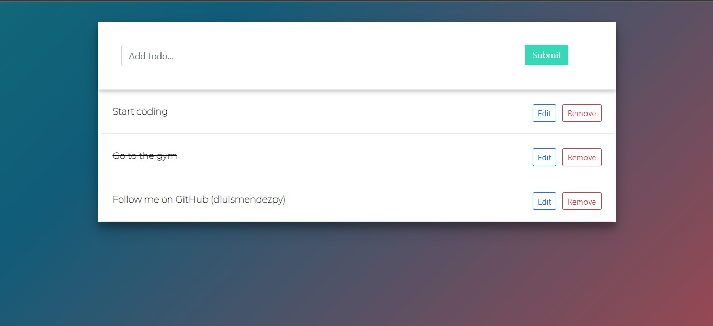

# Todo application using Django and ReactJS

This app was build using django-rest-framework on the backend and Reactjs on the frontend

## Prerequisites
- Docker
- Terminal 

##Setup
### - Step 1: clone repo
`git clone https://github.com/dluismendezpy/todo-api-django-react.git`

### - Step 2: setup compose 
```d
docker-compose build 
docker-compose up
```

### - Step 3: open browser 
Go to `http://127.0.0.1:8000`

## Examples


